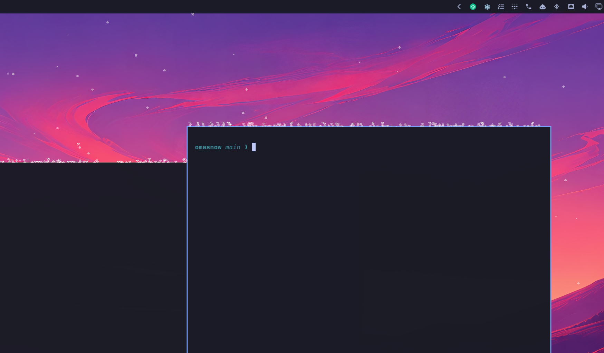

# Omasnow

Xsnow's vintage pixel snow for Omarchy and Hyprland. Real Xsnow bitmap flakes
drift behind windows, collect on exposed window tops, and build up along the
bottom of each screen. Mouse clicks and keyboard input pass through the snow.



The seven vintage masks come from [Wsnow 0.92](https://sourceforge.net/projects/wsnow/files/),
Willem Vermin's MIT-licensed browser version. Their pixel shapes exactly match
the vintage Xsnow flakes.
They render in the classic `snow` color, at native physical-pixel size, with
nearest-neighbor sampling and the classic 50 ms animation cadence. Deposited
snow uses those same bitmap masks, including their holes and jagged edges.
This is a Wayland adaptation of vintage snow, not a port of Xsnow's whole
program: Santa, trees, birds, and modern procedurally generated flakes are
outside its scope. Random motion and window handling are implemented locally.

Requires an Omarchy version with the Quickshell plugin host, Quickshell 0.3+,
Hyprland, and Python 3.10+. No pip packages, compiler, or build step needed.

## Install

Install with Omarchy's built-in plugin manager:

```sh
omarchy plugin add https://github.com/erikwb/omasnow --enable
```

Choose a bar section when prompted (right is the default). Omarchy validates
the plugin, installs it into
`~/.config/omarchy/plugins/io.weirdware.omasnow`, and enables it. The shell starts
the plugin on login. All runtime files are included; no separate setup is needed.

For subsequent updates:

```sh
omarchy plugin update io.weirdware.omasnow
```

## Control

Click the **❄ snowflake** on the right side of the bar to toggle snow. It is
bright when snow is on and dim when off. All monitors and command-line toggles
share the same state. Hover over the icon to see its current state.

```sh
omarchy-shell omasnow toggle
omarchy-shell omasnow clear
omarchy-shell omasnow status
omarchy plugin disable io.weirdware.omasnow
omarchy plugin enable io.weirdware.omasnow
```

`stop` and `start` are also available. Toggle/stop apply to this session;
disable persists across login. For the standalone preview, replace
`omarchy-shell` with `qs ipc -p . call`.

Settings persist inline in the plugin's bar entry in `~/.config/omarchy/shell.json`
(older service-only installations can still use a `plugins[]` entry):

```sh
omarchy-shell omasnow configure '{"flakes":250,"wind":true}'
omarchy-shell omasnow configure '{"pixelSize":2}'
```

| Setting | Default | Meaning |
| --- | --- | --- |
| `flakes` | `100` | Flakes per monitor; 0–2000 |
| `wind` | `true` | Periodic gusts, sideways drift, and snow blown off banks |
| `windowDepth` | `15` | Maximum window snow depth in snow pixels; 0–150 |
| `groundDepth` | `50` | Maximum screen-bottom depth; 0–250 |
| `pixelSize` | `1` | Physical pixels per bitmap pixel; integer 1–4 |
| `hideOnFullscreen` | `true` | Pause and hide snow on a fullscreen monitor |

Set a depth to zero to disable that accumulation. `clear` removes the current
banks and their airborne fragments. `pixelSize: 1` preserves the original bitmap
size even on HiDPI displays; use `2` for an exact integer enlargement. Most snow is naturally hidden when
tiled windows cover the desktop, just as with classic Xsnow.

`flakes` sets the regular falling-flake count, not the total snowfall. Flakes
respawn immediately after landing or leaving the screen, even when the banks
have reached their depth limit. Each keeps its falling speed across respawns
so the snowfall does not gradually slow down. Flakes continue travelling
behind windows, including translucent ones. The `status` command reports
`meanFallSpeed` in snow pixels per second.

The default bank depths follow classic [Xsnow 1.42](https://sources.debian.org/src/xsnow/1%3A1.42-6/): 15 pixels on windows and
50 at the screen bottom. Omasnow caps its bitmap banks at those depths and
keeps replacing landed flakes after a bank fills. Gusts peel snow off exposed
window and ground banks, lifting flakes upward before they fall and settle again.
These use a separate pool of up to 128 extra flakes per monitor, preserving the
regular snowfall. `status` reports their count as `blownFlakes`. Setting `wind`
to `false` stops new blow-off; airborne flakes finish falling. Banks do not melt.
Its recycling is an adaptation:
classic Xsnow leaves an imprint while the particle continues falling, whereas
Omasnow respawns it on landing and preserves its falling speed.

## Remove

```sh
omarchy plugin remove io.weirdware.omasnow
```

Omarchy asks for confirmation, unloads the plugin, and removes its installed
Git checkout. For a linked development checkout, it removes only the link and
keeps the source directory. To keep the installation and disable snow across
logins, use `omarchy plugin disable io.weirdware.omasnow` instead.

## Implementation

`geometry.py` uses Hyprland's [control and event sockets](https://wiki.hypr.land/ipc/).
It coalesces events and refreshes geometry every 250 ms to catch interactive
moves and resizes. It emits JSON only when geometry changes, handles reconnects,
and never enters the animation loop. Window titles and application contents
are not forwarded or stored.

Each monitor has one bottom-layer surface for falling flakes and all snowbanks.
It uses an empty
Quickshell [input region](https://quickshell.org/docs/v0.3.0/types/Quickshell/QsWindow/)
and takes no keyboard focus. The compositor keeps all snow behind application
windows, including floating windows during moves and animations, without waiting
for geometry updates. Window banks clip out reserved bar space. Seven cached
textures render the flakes. Only narrow, changed snow banks repaint their
Canvas textures. Each bank retains its canvas when other windows enter or leave
the monitor, avoiding blank frames from recreating unrelated banks. Snow stops
rendering on sleeping and fullscreen monitors.

Snow follows moved windows. Resizing a bank, switching away from a workspace,
or closing a window discards its old bank; it cannot leave snow suspended in
the old location. Monitor coordinates, rotation, scale, pinned windows, and
special workspaces are handled by the geometry bridge. Hyprland reports target
geometry during some compositor animations, so banks can briefly lead animated
windows; polling can also make them trail a drag. Occlusion by windows remains
immediate. Window borders and arbitrary layer-shell panels are not reported as
client geometry; snow sits at the client top, with reserved bar space excluded.

## Development

To preview this checkout without installing, run `qs -p .` and press Ctrl+C to
stop. Stop the installed plugin first with `omarchy-shell omasnow stop` if it is
running, so the snow is not doubled. Use `omarchy-shell omasnow start` to resume
it after closing the preview.

After editing QML in a linked checkout, run `omarchy restart shell` to load the
updated code. Recursive file watchers may not follow symlinks, and some host
versions retain cached QML even after `rescanPlugins`.

```sh
omarchy plugin validate .
python3 -m unittest discover -s tests -v
node --test tests/*.test.cjs
QT_QPA_PLATFORM=offscreen QT_QUICK_BACKEND=software /usr/lib/qt6/bin/qmltestrunner -input tests/tst_bank.qml
python3 geometry.py --once
python3 tools/build_flakes.py
```

Node is only needed for simulation tests. The asset generator uses Python's
standard library and preserves the upstream masks exactly. See
[`assets/wsnow/README.md`](assets/wsnow/README.md) for provenance.

MIT; see [`LICENSE`](LICENSE). Omasnow copyright 2026 Erik Bourget.
Wsnow artwork copyright 2020 Willem Vermin; its license and source declaration
are preserved in [`assets/wsnow/`](assets/wsnow/). Rick Jansen created the original
Xsnow artwork and is acknowledged by Wsnow. See [`THIRD_PARTY_NOTICES.md`](THIRD_PARTY_NOTICES.md).
